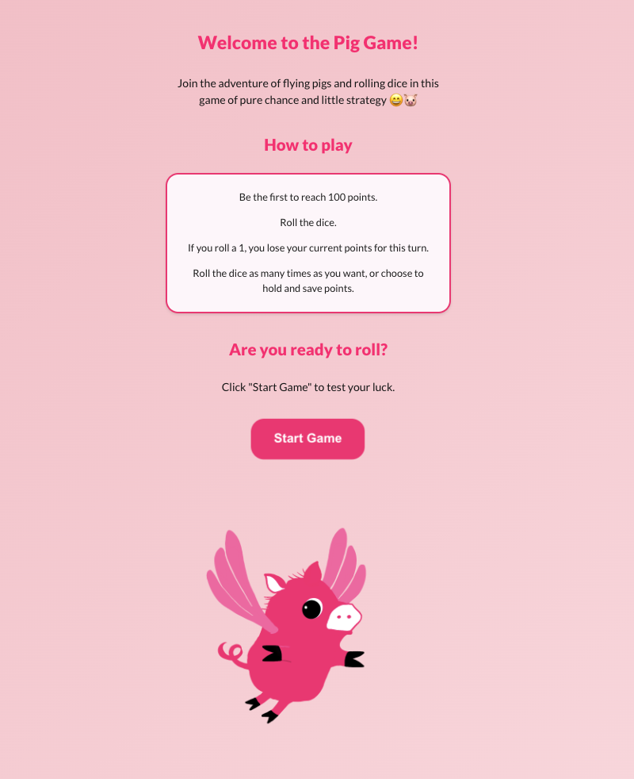
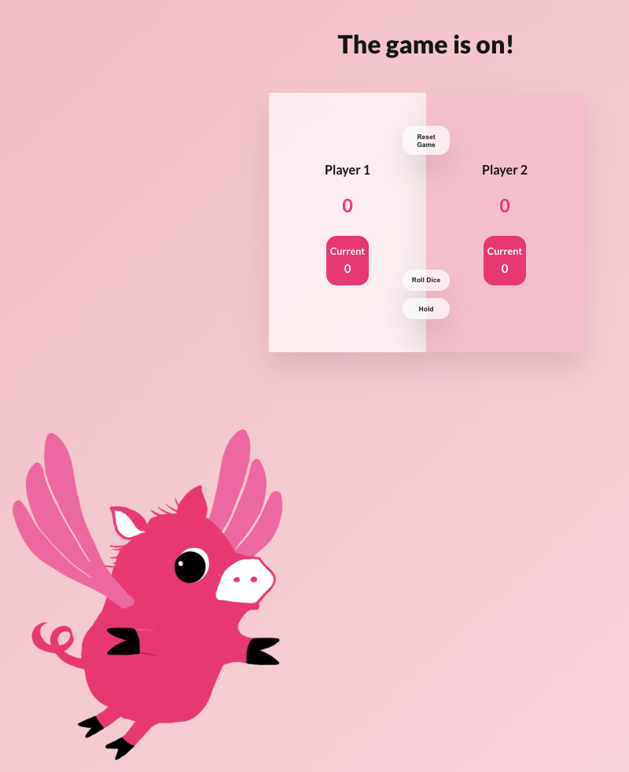

# Pig Game in React

## Table of contents

- [Overview](#overview)
  - [About the game](#about-the-game)
  - [Screenshot](#screenshot)
- [My process](#my-process)
  - [Built with](#built-with)
  - [What I learned and reminders](#what-i-learned-and-reminders)
  - [Enhancement considerations](#enhancement-considerations)
  - [Useful resources](#useful-resources)

## Overview

Build a Pig Game in React.

### About the game

The Pig game is a simple dice game where players take turns rolling a single die as many times as they like, accumulating points for each roll. However, if a player rolls a 1, they lose all points accumulated in that turn and their turn ends. Players can choose to "hold" at any time to add their turn's points to their total score. The first player to reach a total score of a 100 or more wins.

### Screenshot




## My process

### Built with

- CSS
- Flexbox
- JSX
- React

### What I learned and reminders

I used useEffect to ensure that the setTimeout is only called once after the component mounts, and is properly cleaned up when the component unmounts or when the dependencies change. If I use setTimeout directly in the functional component body, it might cause unexpected behavior because setTimeout will be re-executed on each render.

Remember to call the click event within the StartPage component:

```js
export default function StartPage({ onStartClick })
// ...
  <h2>Are you ready to roll?</h2>
      <p>Click Start Game to test your luck.</p>
      <button onClick={onStartClick}>Start Game</button>
```

And here's what it looks like in the App.jsx component:

```js
export default function App() {
  const [gameStarted, setGameStarted] = useState(false);

  const handleStartClick = () => {
    setGameStarted(true);
  };

  return (
    <>
      {gameStarted ? <Game /> : <StartPage onStartClick={handleStartClick} />}
    </>
  );
}
```

Remember to add a semi-colon after the quotation mark entity:

```js
<p>Click &#x0022;Start Game&#x0022; to test your luck.</p>
```

I really like this box-shadow code:

```css
box-shadow: 0 1.75rem 3.5rem rgba(0, 0, 0, 0.1);
```

Making the start game button pulse a little bit with the help of CSS:

```css
.start-game-btn {
  animation: pulse 1.5s infinite alternate;
}

@keyframes pulse {
  0% {
    transform: scale(1);
  }
  100% {
    transform: scale(1.05);
  }
}
```

### Enhancement considerations

Change the title to reflect when the game is over.

Place buttons below the player sections on smaller screens to make the layout more accessible.

Still some general CSS touch-ups needed.

### Useful resources

- [Example resource 1](https://www.example.com) - This helped me for XYZ reason. I really liked this pattern and will use it going forward.
